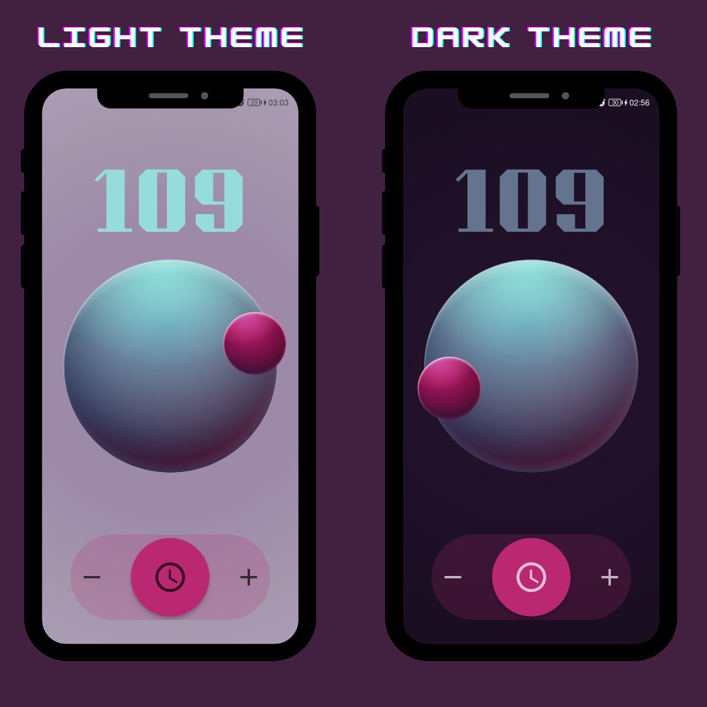
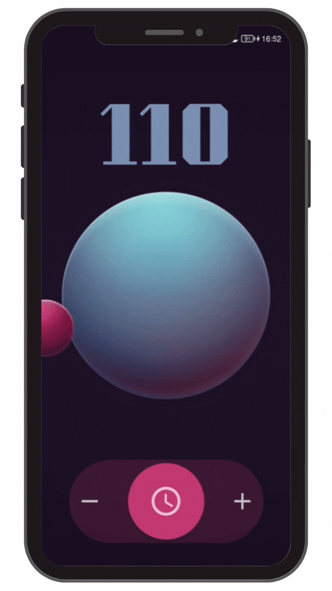

# beautiful_counter 🌒

Built using the popular Flutter framework. This is a Beautiful Counter App. I remade it like it was a pimp my ride episode. 

### Some concepts that were utilised in the development of this app
- Bloc State management
- Bloc Architecture: Separation of concerns (Logic vs UI)
- Flutter animations: Rive
- Custom Theming: Light Mode vs Dark Mode (Dynamic)
- Data Persistence: Hive/Hydrated Bloc
- Modularize: Refactoring Widgets
- Event-driven programming
- Pubspec.yaml for external Packages like Google Font assets

*****
## Screenshots
\

****
## Getting Started

If you want learn how to build Flutter applications.

A few resources to get you started on your first Flutter project:

- [Lab: Write your first Flutter app](https://docs.flutter.dev/get-started/codelab)
- [Cookbook: Useful Flutter samples](https://docs.flutter.dev/cookbook)

For help getting started with Flutter development, view the
[online documentation](https://docs.flutter.dev/), which offers tutorials,
samples, guidance on mobile development, and a full API reference.

Best Regards,\
Elias Kekana
